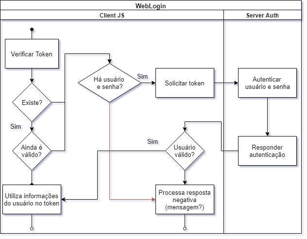

# Funções para tratamento de login



Utilização de token armazenado em cookie

0. [x] Instanciação do objeto WebLogin: parâmetros = URL de autenticação do server auth, e método call-back geral.
1. Na instanciação, verifica se o cookie do token existe e ainda contém informações válidas. Se for verdade, utiliza as informações do usuário no token.
1. Ao iniciar, WebLogin verifica se o cookie existe e autentica o token no servidor


## Detalhes do cookie

JSON com a estrutura abaixo:

```
{
  token:'00000000000000000...',
  expires:0000,
  data: {}
}
```

## Retorno do servidor auth

```
{
token:'000000000000...',
expires:0000,
data:{}
}
```

## Padrão de URL 

### Solicitação de login para o usuário com senha (POST)
(url)?login=userName&pass=userPassword

* Retorno da solicitação pelo server auth com autorização OK (expires > 0)
```
{
token:'000000000000...',
expires:909020910,
message:'OK',
data:{}
}
```

* Retorno da solicitação pelo server auth sem autorização (expires = 0 e mensagem de erro em message)
```
{
token:'000000000000...',
expires:0,
message:'LOGIN ERROR',
data:{}
}
```

### Solicitação de logout para o usuário (GET)
(url)?logout=token

### Solicitação de validade do token (GET)
(url)?check=token

Na solicitação da validade do token, o servidor auth atualiza a validade, incrementando o tempo em segundos desde 01/01/1970
```
{
token:'000000000000...',
expires:0000
}
```


## Instalar servidor para testes

* npm install http-server -g
* http-server ./
* node server.js

## Instalação do GULP

* npm install gulp-cli -g
* npm install gulp -D

https://stackoverflow.com/questions/4720343/loading-basic-html-in-node-js